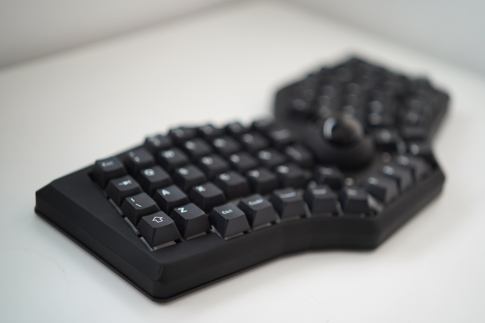

# Fingerpunch Rock On

Rock On is a 69-keys, ergonomic ortholinear unibody keyboard by [Fingerpunch](https://fingerpunch.xyz/). This build uses version 3.1 of the PCB, which supports MX/Choc switch, per-key-LEDs, trackball, Cirque trackpad, 3 rotary encoders, audio, as well as haptic feedback. 

I prefer ergo ortho keyboards in unibody form over split keyboards, so I was really excited when I found this. 

I re-designed a new case for it, based on the existing Rock On case. This design gives it a more modern, angular look. The top half is 3D printed using black resin, while the bottom half is printed using PLA.

I love the PCB & the logo, so I created a small window at the bottom. It's printed using transparent resin.

Finally, one unique decorative element of the case is the illuminated Rock On logo on the trackball cover. I use two SK6812 mini-e RGB LEDs, one under the logo, and another one under the trackball. These LEDs are soldered to the existing LED pads on the PCB using AWG 30 wires. It's a tedious work but worth the effort.

